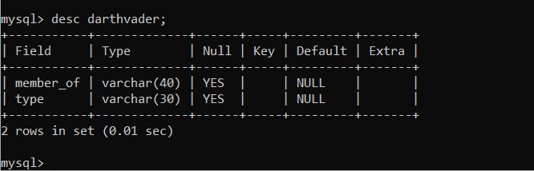

# Cognizance2020
>## Project: Messenger
 * ### __INTRODUCTION__ 
    The following program is losely based on __*messenger*__. Though it still has a few errors it can perform  the following __functions__ : -
    * make profile that lets you create your profile with picture, basic info and about me.
    * let you search and add friends through it.(you can even see their profiles with mutual friends and discover friends from their friend list.)
    * you can communicate with your friends( though the current version is working for 2 user over a local machine and csn send only text messages.)
    * you delete your messages from via 2 options: -
        * __delete for me__ - this option lets you delete the messages from only your side i.e. the other user can still see it.
        * __delete for all__ - this option lets you delete only messages you sent for both participants. 
    * the search option uses following fields __email address or username__. 
    * It also allows you to see whether your friend is online or not, if not then it shows the last date and time they were active.
* ### __TECHNICAL INFO__
    * It uses __JAVA__ as a front end and __MySql__ as backend.
    * It communicates using _JAVA networking server and socket_.
        * usually server and socket are made on different classes. 
            * for server: -like this
                 ```JAVA
                import java.io.DataInputStream;
                import java.io.DataOutputStream;
                import java.net.ServerSocket;
                .
                .
                .
                try{
                    ss=new ServerSocket(i);
                    s=ss.accept();
                    System.out.println("server on");
                    din=new DataInputStream(s.getInputStream());
                    dout=new DataOutputStream(s.getOutputStream());

                    while(true){
                        msgin=din.readUTF();
                        jTextArea1.append(id2+": "+msgin+"\n");

                        if(msgin.equals("exit")){
                            ss.close();
                         }
                
                    }

                 }
                catch(Exception o){System.out.print(o+"pp");
                }
                ```
            * for client:- like this
                
                ```JAVA
                import java.io.DataInputStream;
                import java.io.DataOutputStream;
                import java.net.Socket;
                .
                .
                .
                try {
                    s = new Socket("127.0.0.1",1200);
                    din=new DataInputStream(s.getInputStream());
                    dout=new DataOutputStream(s.getOutputStream());
                    String msgin="";
        
                    while(!msgin.equals("exit")){
                        msgin=din.readUTF();
                        jTextArea1.append(id2+": "+msgin+"\n");
                    }
                 }
                catch(Exception e){
                    System.out.println(e);}
                ```
                
         * but in this project it uses __mutiple try and catch statements__.
        ```java
        try {
            s = new Socket("127.0.0.1",1200);
            din=new DataInputStream(s.getInputStream());
            dout=new DataOutputStream(s.getOutputStream());
            String msgin="";
        
            while(!msgin.equals("exit")){
                msgin=din.readUTF();
                jTextArea1.append(id2+": "+msgin+"\n");
            
            }
            }
        catch(Exception e){

            if(e.toString().equals("java.net.ConnectException: Connection refused: connect")){
                String msgin="" ;
                try{
                    ss=new ServerSocket(i);
                    s=ss.accept();
                    System.out.println("server on");
                    din=new DataInputStream(s.getInputStream());
                    dout=new DataOutputStream(s.getOutputStream());

                    while(true){
                        msgin=din.readUTF();
                        jTextArea1.append(id2+": "+msgin+"\n");

                        if(msgin.equals("exit")){
                            ss.close();
                        }
                
                     }

                }
                catch(Exception o){
                    System.out.print(o+"pp");
                }
            }
            else if(e.toString().equals("java.net.SocketException: Connection reset")){
                String msgin="" ;
                try{
                    ss=new ServerSocket(1200);
                    s=ss.accept();
                    System.out.println("server on");
                    din=new DataInputStream(s.getInputStream());
                    dout=new DataOutputStream(s.getOutputStream());

                    while(true){
                        msgin=din.readUTF();
                        jTextArea1.append(id2+": "+msgin+"\n");
               
                         if(msgin.equals("exit")){
                            s.close();
                         } 
      
                    }

                }
                catch(Exception o){System.out.print(o +"ll");
                }
            } 
            else{System.out.println(e+"kk");}
        }
        ```
        * I used this link to gather information about [server and socket](https://www.tutorialspoint.com/java/java_networking.htm#:~:text=A%20client%20program%20creates%20a,that%20socket%20to%20a%20server.&text=Socket%20class%20represents%20a%20socket,and%20establish%20connections%20with%20them. "click this to understand it better")
    * for tables in mysql it has several tables:-

        
        * structure of __id__ table which is the only manually created table is
        * rest tables are either created when we sign-up or make friends. Their structure are as follows.
            * \<username> - this table is made on signup and contains list of our friends: -
            
            * \<username>_profile - this table is made on signup and contains our about me and profile picture.
            
            * \<username>_req - this table is made on signup and contains friend requests.
            
            * msg\_\<username1>_\<username2> - this table is made on making friends and contains all our messages.
            
