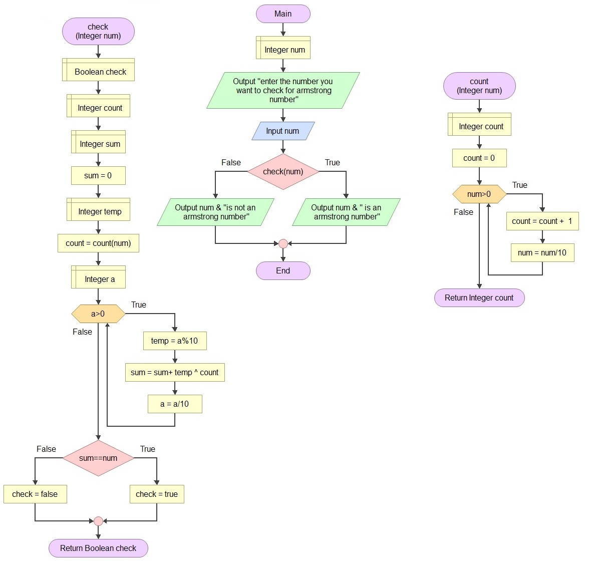

# ARMSTRONG NUMBER
* ##  It is  Armstrong numbers are the sum of their own digits to the power of the number of digits.
  ## eg : -  
  * ## eg :- 153 = 13 + 53 + 33
   * ## eg :- 1634 = 14 + 64 + 34 + 44
* ## pseudo code
        Function Main
            Declare Integer num
    
            display "enter the number you want to check for armstrong number"
            enter value of num
            If check(num)
                then display num & " is an armstrong number"
            else
                display num & "is not an armstrong number"
            End
        End

        Function check (Integer num)
            Declare Boolean check
            Declare Integer count
            Declare Integer sum
            Declare Integer temp
            Declare Integer a

            set sum = 0
            set count = count(num)
            set a = num
            While a is greater than 0
                calculate temp = a%10
                calcuate sum = sum+ temp ^ count
                set a = a/10
            End
            If sum is equal to num
                 then set check = true
            else
                 set check = false
             End
        Return Boolean check

        Function count (Integer num)
            Declare Integer count
    
            set count = 0
            While num greater than 0
                increase value of count by 1
                set value of num = num/10
            End
        Return Integer count
    * ## 
